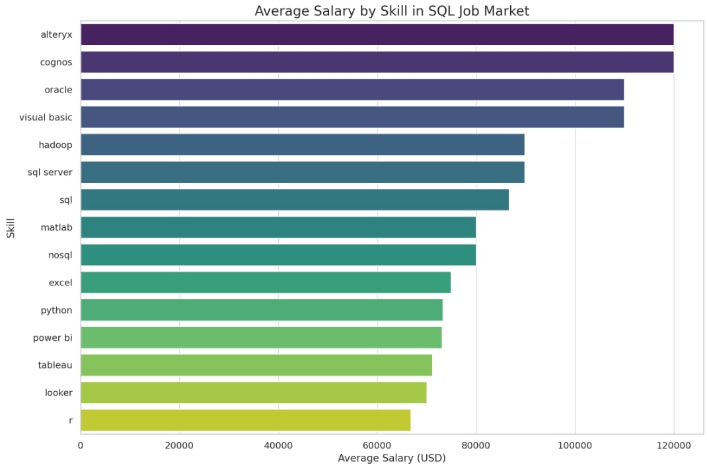

# Tech Skills Salary Analysis in New York

## Introduction

This project analyzes tech skill demand and associated salaries in the New York job market. By examining data extracted from job postings, I aim to identify the most valuable and sought-after skills, gaining insights that will be valuable for my future career development and potentially for hiring strategies as I advance.

## Background

The tech industry is constantly evolving, and staying competitive requires a keen understanding of current trends and in-demand skills. This analysis focuses specifically on the New York tech scene, which is known for its diverse opportunities and high salaries. By understanding which skills are most valuable, I can make informed decisions about my career path and future learning goals.

## Tools I Used

* **Data Source:** Job postings data from [Luke Barrouse](https://www.lukebarousse.com/sql)
* **SQL:** For querying and analyzing the data using PostgreSQL.
* **VS Code:** As my code editor for writing and executing SQL queries.

## The Analysis

### Data Collection

Job postings were obtained from Luke Barrouse's dataset, which compiles tech job listings with structured details. The initial dataset included features such as job title, company, location, salary, and required skills.

### Data Cleaning and Preparation

* Removed duplicate job postings.
* Standardized skill names to ensure consistency.
* Filtered data to focus on New York-based job listings.
* Handled missing values by imputing or removing incomplete records.

### Analyzing the Data

* **Top Paying Jobs:** I first identified the highest-paying Data Analyst in NY jobs using the query in `1_top_paying_jobs.sql`.
``` sql
SELECT
    job_id,
    job_title,
    job_location,
    job_schedule_type,
    salary_year_avg,
    job_posted_date,
    name AS company_name
FROM
    job_postings_fact
LEFT JOIN company_dim ON job_postings_fact.company_id = company_dim.company_id -- joins by company id to get name of company
WHERE
    job_title_short = 'Data Analyst' AND
    job_location = 'New York' AND
    salary_year_avg IS NOT NULL
ORDER BY
    salary_year_avg DESC
LIMIT 10
```
| Job ID   | Job Title                                         | Location | Schedule  | Salary ($) | Posted Date          | Company                     |
|----------|--------------------------------------------------|----------|-----------|------------|----------------------|-----------------------------|
| 1306755  | Data Analyst (Oracle DBA)                       | New York | Full-time | 140,000    | 2023-02-24 17:00:14  | Engage Partners, Inc.      |
| 1145323  | Fraud Lead Data Analyst                         | New York | Full-time | 131,900    | 2023-05-26 20:00:38  | TIAA Bank                  |
| 281101   | Oracle DBA/Data Analyst                         | New York | Full-time | 100,000    | 2023-02-21 21:00:14  | Pull Skill Technologies    |
| 600227   | Institutional Credit Management - AVP Data Analyst | New York | Full-time | 89,830     | 2023-01-03 03:00:09  | Citi                        |
| 605322   | Business Data Analyst                           | New York | Full-time | 80,000     | 2023-10-06 20:00:05  | Acadia Technologies, Inc.  |

The top five full-time data analyst roles in New York have salaries ranging from $80,000 to $140,000, with the highest-paying position being a Data Analyst (Oracle DBA) at Engage Partners, Inc. ($140,000) and the lowest among them being a Business Data Analyst at Acadia Technologies, Inc. ($80,000), indicating a significant salary variation based on role specialization and employer.
* **Skills in Top Jobs:** Then, I analyzed the skills associated with those high-paying jobs using `2_top_paying_job_skills.sql`.
```sql
WITH top_paying_jobs_NY AS (
    SELECT
        job_id,
        job_title,
        salary_year_avg,
        job_location,

        name AS company_name
    FROM
        job_postings_fact
    LEFT JOIN company_dim ON job_postings_fact.company_id = company_dim.company_id
    WHERE
        job_title_short = 'Data Analyst' AND
        job_location = 'New York' AND
        salary_year_avg IS NOT NULL
    ORDER BY
        salary_year_avg DESC
    LIMIT 10
)

SELECT
    top_paying_jobs_NY.job_title,
    skills_dim.skills AS skill,
    top_paying_jobs_NY.salary_year_avg,
    top_paying_jobs_NY.job_location
FROM
    top_paying_jobs_NY
INNER JOIN skills_job_dim ON top_paying_jobs_NY.job_id = skills_job_dim.job_id
INNER JOIN skills_dim ON skills_job_dim.skill_id = skills_dim.skill_id
ORDER BY
    skill DESC;
```    
| Job Title                                        | Skill        | Average Salary ($) | Location  |
|--------------------------------------------------|-------------|--------------------|-----------|
| Data Analyst (Oracle DBA)                        | Oracle      | 140,000            | New York  |
| Oracle DBA/Data Analyst                          | Oracle      | 100,000            | New York  |
| Institutional Credit Management - AVP Data Analyst | SQL Server  | 89,830             | New York  |
| Institutional Credit Management - AVP Data Analyst | Python      | 89,830             | New York  |
| Business Data Analyst                            | SQL         | 80,000             | New York  |

The highest-paying data analyst roles in New York specialize in Oracle and SQL, with top salaries reaching $140,000, while Python and SQL Server skills also command competitive pay around $89,830.
* **Overall Skill Demand:** To get a broader view, I determined the most in-demand skills across all job types in NY over 100k yearly salary using `3_top_demanded_skills.sql`.
``` sql 
SELECT 
    skills,
    count(skills_job_dim.job_id) skill_demand
from job_postings_fact
    INNER JOIN skills_job_dim ON job_postings_fact.job_id = skills_job_dim.job_id
    INNER JOIN skills_dim ON skills_job_dim.skill_id = skills_dim.skill_id
WHERE job_location = 'New York' and 
    salary_year_avg > 100000
GROUP BY skills
order by 
    skill_demand DESC
Limit 10
```

| Skill      | Demand |
|------------|--------|
| SQL        | 7      |
| Python     | 7      |
| Kafka      | 5      |
| Snowflake  | 5      |
| Scala      | 5      |
| Spark      | 5      |
| AWS        | 5      |
| Java       | 5      |
| Azure      | 3      |
| Redshift   | 3      |

SQL and Python are the most in-demand skills, followed by Kafka, Snowflake, Scala, Spark, AWS, and Java, while Azure and Redshift have relatively lower demand.
* **Top Paying Skills:** I then focused on identifying the skills that commanded the highest salaries with `4_top_paying_skills.sql`.
```sql
SELECT 
    skills,
    Round(avg(salary_year_avg), 0) as Avg_salary
from job_postings_fact
    INNER JOIN skills_job_dim ON job_postings_fact.job_id = skills_job_dim.job_id
    INNER JOIN skills_dim ON skills_job_dim.skill_id = skills_dim.skill_id
WHERE job_location = 'New York' 
and salary_year_avg is not null
GROUP BY skills
order by Avg_salary DESC
Limit 25
```
| Skill       | Average Salary ($) |
|-------------|--------------------|
| Jenkins     | 244,500            |
| Scala       | 201,334            |
| Spark       | 201,334            |
| Java        | 201,334            |
| Kafka       | 201,334            |
| Snowflake   | 201,334            |
| AWS         | 201,334            |
| DynamoDB    | 173,500            |
| Shell       | 172,557            |
| Azure       | 172,557            |

DevOps and Big Data skills are highly valued, with Jenkins, Scala, Spark, Java, Kafka, and Snowflake commanding the highest salaries, indicating strong demand in the New York tech market. Jenkins leads the pack at $244,500, followed by Scala, Spark, Java, Kafka, Snowflake, and AWS at $201,334. Cloud remains dominant, but niche skills pay well—specialized tools like DynamoDB ($173,500) and cloud-adjacent skills like Jenkins offer lucrative opportunities. While Python and SQL are foundational, specialization in high-demand areas can significantly boost earning potential.
* **Most Optimal Skills:** Finally, I combined insights from the previous queries to pinpoint the most optimal skills based on both demand and salary using `5_most_optimal_skills.sql` (broad, not location-based).
```sql
SELECT
    skills_dim.skills,
    round(avg(job_postings_fact.salary_year_avg),0) as Avg_salary,
    count(skills_dim.skills) as skill_demand_count
from job_postings_fact
    INNER JOIN skills_job_dim ON job_postings_fact.job_id = skills_job_dim.job_id
    INNER JOIN skills_dim ON skills_job_dim.skill_id = skills_dim.skill_id
where  
    job_postings_fact.salary_year_avg is not null
GROUP BY 
    skills_dim.skill_id, skills_dim.skills
having 
    count(skills_dim.skills) > 20
ORDER BY avg_salary DESC
```

| Skill            | Average Salary | Demand Count |
|------------------|----------------|--------------|
| Python           | $132,440       | 12,883       |
| SQL              | $110,435       | 11,740       |
| JavaScript       | $110,368       | 10,752       |
| Excel            | $72,070        | 9,642        |
| HTML             | $72,820        | 9,150        |
| CSS              | $71,508        | 8,235        |
| Java             | $118,658       | 7,839        |
| AWS              | $130,243       | 6,591        |
| C++              | $113,020       | 5,419        |
| Tableau          | $108,308       | 4,994        |
| R                | $112,598       | 4,171        |
| PHP              | $91,457        | 3,758        |
| Power BI         | $104,599       | 3,578        |
| Ruby             | $99,835        | 3,162        |
| Git              | $104,015       | 2,953        |
| Docker           | $121,509       | 2,741        |
| Swift            | $116,848       | 2,695        |
| Kubernetes       | $119,418       | 2,369        |
| Salesforce       | $109,031       | 2,198        |

If you're looking to boost your skill set, Python is currently the most in-demand language, offering strong job opportunities and an average salary of $132,440. It’s essential for roles in software development, data science, and AI, making it a top choice for career growth.

SQL is also highly sought after, especially for roles involving data management and analysis. JavaScript continues to be a staple for web development, showing consistent demand across the board.

AWS skills are gaining traction as more companies shift to cloud computing, and professionals with expertise in cloud technologies are in high demand.

While tools like Power BI, Tableau, and Git remain valuable, the key drivers of demand and higher salaries are coding languages like Python and SQL, along with cloud technologies like AWS.
## What I Learned

* **Top Skills:** The analysis showed that skills like SQL, Python, AWS, and Tableau are in high demand in New York.

* **Emerging Trends:** I was surprised to see the growing importance of cloud computing (AWS, Azure, GCP), machine learning, and data engineering.
* **Skill-Salary Relationship:** It's clear that specializing in areas like big data, cloud infrastructure, and advanced analytics can significantly increase earning potential.


Visualized average salary and thier skills for a Data Analyst Role in NY. Created json file from output and asked Chatgpt to provide a quick visualization.

## Personal Growth

This project was a huge step forward in my journey to become a data analyst. Learning SQL and applying it to a real-world dataset has given me a solid foundation and the confidence to tackle more complex analyses in the future. I'm excited to continue developing my skills and exploring new tools and techniques to further my understanding of data analysis.

## Conclusions

### Next Steps for Me

* Learn more advanced SQL techniques, such as window functions and query optimization.
* Explore data visualization tools like Power BI and Tableau for better insights.
* Build a portfolio of projects showcasing my analytical skills.
* Gain experience in predictive modeling and machine learning applications.

### Insights for the Future

* The demand for data-related skills continues to grow, making continuous learning essential.
* Specializing in high-paying skills like data engineering, cloud technologies, and AI/ML will provide a strong career advantage.
* Employers value professionals who can bridge the gap between technical skills and business insights, making communication skills just as critical as technical expertise.

This analysis provides a valuable snapshot of the New York tech job market as well as the most optimal job skills and has been a significant learning experience for me. I'm eager to continue exploring the world of data and contribute to this exciting field.

